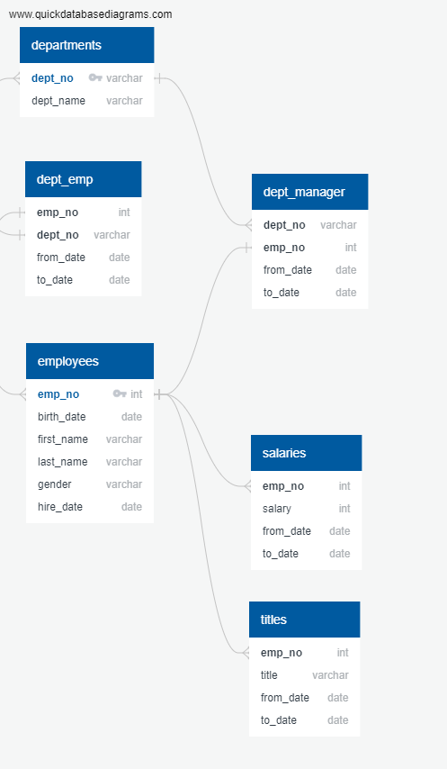
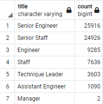
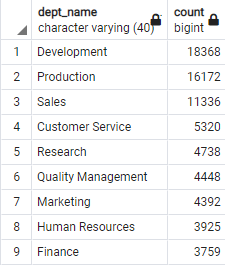
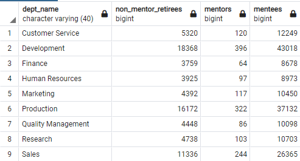

# Pewlett-Hackard-Analysis

## Overview
This project involves loading CSV-formatted spreadsheets into a database, then using SQL queries to analyze larger quantities of data than are easily consumable in spreadsheet form. The analysis centers around determining which employees from this very large dataset are likely to retire soon and what departments they are retiring from in order to prepare management for the large-scale anticipated turnover.

## Results

### Retiring Employees by Title (and Department)

|Retiring Employees by Title|Retiring Employees by Department|
|---|---|
|| 

* The majority of expected retirees hold senior positions. It will be harder to find suitable replacements for these positions, so Pewlett-Hackard would do well to start looking early, or to focus on employee deployment so that existing employees can be promoted into these positions when they become vacant.
* The Development and Production Departments will be hit hardest by surging retirement, so internal development efforts will likely be most fruitful here.
* Given the number of expected retirees, shockingly few are managers. Pewlett-Hackard might want to look into its promotion practices or the accuracy of its data.

### Mentorship Eligibility
* While the number of retiring employees is enormous, very few fit the given criteria for mentorship. Pewlett-Hackard may want to consider broadening the pool of candidates eligible for mentorship beyond those born in 1965 in order to ensure that enough younger employees can be mentored before the retirement wave hits.

## Summary
* 72,458 employees are expected to retire in the next few years, over 30% of the company.
* Only 1,549 expected retirees meet the given criteria for mentorship, nowhere near enough to provide enough guidance and support for the development of the younger generation of employees.